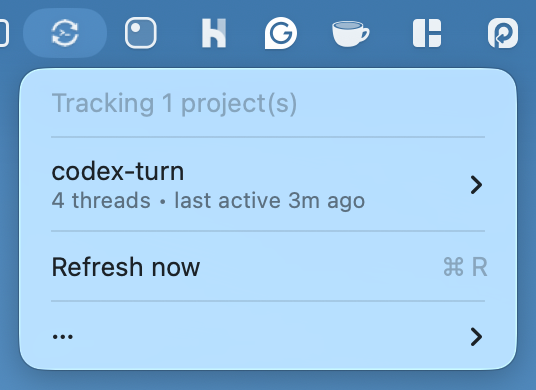

# CodexTurn

CodexTurn is a macOS menu bar app for people juggling multiple Codex threads across multiple projects.

It watches your local Codex session history and tells you when a thread is waiting on **you**.



## Why I built this

I work across multiple apps and issues at the same time. The hardest part is not writing code — it’s recovering context after every interruption.

A post by Addy Osmani highlights the cognitive cost of interruptions and references research showing it can take ~23 minutes to fully get back into a task after context switching.

That is exactly the problem CodexTurn tries to solve: reduce the “what was I doing?” tax by making your pending Codex turns visible and actionable.

Reference: [It takes 23 mins to recover after an interruption](https://addyo.substack.com/p/it-takes-23-mins-to-recover-after)

## What CodexTurn does

- Scans recent Codex sessions under your local Codex home.
- Combines Codex Desktop App worktrees from the same repo into one project (default); disable for per-folder view.
- Shows projects and threads in the menu bar with clear status labels.
- Sends local macOS reminders when your reply is overdue.
- Runs locally against your session files.

## Requirements

- macOS 13+
- Swift 5.9+ (only needed to build from source)

## Install

### Option 1: Download a release (recommended)

Download the latest `.dmg` or `.zip` from [GitHub Releases](../../releases/latest), then move **CodexTurn.app** to **Applications**.

### Option 2: Install with Homebrew

```bash
brew install --cask hosmelq/tap/codexturn
```

Or tap once and install by name:

```bash
brew tap hosmelq/tap
```

```bash
brew install --cask codexturn
```

### Option 3: Build from source

```bash
swift build
swift run CodexTurn
```

## Usage

1. Launch **CodexTurn**.
2. Open the menu bar icon to see projects and threads.
3. Open **Settings…** and tune your thresholds.
4. Enable notifications when prompted.

Thread statuses:

- **Your turn**: assistant replied last.
- **Assistant turn**: you replied last.
- **Overdue**: your turn exceeded your configured threshold.

## Development

```bash
make format
make format-check
make lint
swift test
```

## Changelog

See [CHANGELOG.md](./CHANGELOG.md).
